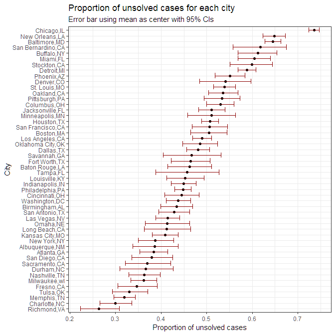

p8105\_hw5\_yc3242
================
Youn Kyeong Chang (uni\# yc3242)
November 7, 2018

``` r
library(tidyverse)
```

    ## -- Attaching packages ------------------------------------------- tidyverse 1.2.1 --

    ## v ggplot2 3.0.0     v purrr   0.2.5
    ## v tibble  1.4.2     v dplyr   0.7.6
    ## v tidyr   0.8.1     v stringr 1.3.1
    ## v readr   1.1.1     v forcats 0.3.0

    ## -- Conflicts ---------------------------------------------- tidyverse_conflicts() --
    ## x dplyr::filter() masks stats::filter()
    ## x dplyr::lag()    masks stats::lag()

### Problem 1

#### 1-(1)

: Create a tidy dataframe containing data from all pariticipants, including the subject ID, arm, and observations over time.

``` r
# Started with a dataframe containing all file names
study_data = 
  tibble(file_names = list.files(path = "data/", full.names = T))

# Iterated over file names and read in data for each subject and saved them as a data variable in the dataframe
study_data$data =
  map(study_data$file_names, read_csv)

# Tidied data 
study_data =
  study_data %>% 
  unnest() %>% 
  separate(file_names, into = c("arm", "id"), sep = "_") %>% 
  mutate(arm = str_remove(arm, "data/"),
         id = str_remove(id, ".csv")) %>% 
  gather(key = "week", value = "obs", "week_1":"week_8") %>% 
  mutate(week = as.numeric(str_remove(week, "week_")))
```

#### 1-(2)

: Spaghetti plot showing observations on each subject over time.

``` r
study_data %>% 
  ggplot(aes(x = week, y = obs, group = id)) +
  geom_line(aes(color = arm), size = 1) +
  labs(
    title = "Observations on each subject over time",
    y = "observation"
  ) +
  facet_grid(~ arm) +
  stat_summary(aes(group = arm), fun.y = "mean", geom = "point", 
               color = "blue", size = 3, shape = 17) +
  theme_bw() +
  theme(plot.title = element_text(size = 12),
        strip.background = element_rect(fill = "black"),
        strip.text = element_text(color = "white", face = "bold")) 
```


Average observation is similar at starting point week 0 but over time, average observation in control group remains constant while in exosure group is increasing.

### Problem 2

#### 2-(1)

: load and describe raw data.

``` r
homicide_data = 
  read_csv("https://raw.githubusercontent.com/washingtonpost/data-homicides/master/homicide-data.csv") %>% 
  janitor::clean_names()
```

    ## Parsed with column specification:
    ## cols(
    ##   uid = col_character(),
    ##   reported_date = col_integer(),
    ##   victim_last = col_character(),
    ##   victim_first = col_character(),
    ##   victim_race = col_character(),
    ##   victim_age = col_character(),
    ##   victim_sex = col_character(),
    ##   city = col_character(),
    ##   state = col_character(),
    ##   lat = col_double(),
    ##   lon = col_double(),
    ##   disposition = col_character()
    ## )

The data consists of 52179 observations and 12 variables as follows:

-   `uid`: report identifier
-   `reported_date`: reported date
-   `victim_last`: Last name of victim
-   `victim_first`: First name of victim
-   `victim_race`: Race of victim
-   `victim_age`: Age of victim
-   `victim_sex`: Sex of victim
-   `city`: city of homicide
-   `state`: State of homicide
-   `lat`: latitude of homicide
-   `lon`: longitude of homicide
-   `disposition`: Case classification

#### 2-(2)

: Create a `city_state` variable.

``` r
homicide_data = 
  homicide_data %>% 
  unite(city_state, city, state, sep = ",") %>% 
  mutate(city_state = recode(city_state, "Tulsa,AL" = "Tulsa,OK")) 
```

#### 2-(3)

: Total number of homicide and the number of unsolved homicides.

``` r
ttl_unsol = 
homicide_data %>%
  group_by(city_state) %>% 
  summarize(total = n(), 
            unsolved = sum(disposition %in% c("Closed without arrest", "Open/No arrest")))

ttl_unsol
```

    ## # A tibble: 50 x 3
    ##    city_state     total unsolved
    ##    <chr>          <int>    <int>
    ##  1 Albuquerque,NM   378      146
    ##  2 Atlanta,GA       973      373
    ##  3 Baltimore,MD    2827     1825
    ##  4 Baton Rouge,LA   424      196
    ##  5 Birmingham,AL    800      347
    ##  6 Boston,MA        614      310
    ##  7 Buffalo,NY       521      319
    ##  8 Charlotte,NC     687      206
    ##  9 Chicago,IL      5535     4073
    ## 10 Cincinnati,OH    694      309
    ## # ... with 40 more rows

#### 2-(4)

: For the city of Baltimore, MD, estimate the proportion of homicides that are unsolved.

``` r
# ttl_unsol only for Baltimore,MD
ttl_unsol_balti = 
  ttl_unsol %>% 
  filter(city_state == "Baltimore,MD") 

# Prop.test
balti_prop = 
  prop.test(ttl_unsol_balti$unsolved, ttl_unsol_balti$total)

balti_prop
```

    ## 
    ##  1-sample proportions test with continuity correction
    ## 
    ## data:  ttl_unsol_balti$unsolved out of ttl_unsol_balti$total, null probability 0.5
    ## X-squared = 239.01, df = 1, p-value < 2.2e-16
    ## alternative hypothesis: true p is not equal to 0.5
    ## 95 percent confidence interval:
    ##  0.6275625 0.6631599
    ## sample estimates:
    ##         p 
    ## 0.6455607

``` r
# Dataframe
balti_prop_df =
  balti_prop %>% 
  broom::tidy() %>% 
  select(estimate, conf.low, conf.high)

balti_prop_df
```

    ## # A tibble: 1 x 3
    ##   estimate conf.low conf.high
    ##      <dbl>    <dbl>     <dbl>
    ## 1    0.646    0.628     0.663

### 2-(5)

: proportion of unsolved homicides for each of the cities

``` r
prop_unsol = 
  ttl_unsol %>% 
  mutate(test_res = map2(unsolved, total, prop.test)) %>% 
  mutate(est_CI = map(test_res, broom::tidy)) %>% 
  select(city_state, est_CI) %>% 
  unnest() %>% 
  select(city_state,estimate, conf.low, conf.high)

prop_unsol
```

    ## # A tibble: 50 x 4
    ##    city_state     estimate conf.low conf.high
    ##    <chr>             <dbl>    <dbl>     <dbl>
    ##  1 Albuquerque,NM    0.386    0.337     0.438
    ##  2 Atlanta,GA        0.383    0.353     0.415
    ##  3 Baltimore,MD      0.646    0.628     0.663
    ##  4 Baton Rouge,LA    0.462    0.414     0.511
    ##  5 Birmingham,AL     0.434    0.399     0.469
    ##  6 Boston,MA         0.505    0.465     0.545
    ##  7 Buffalo,NY        0.612    0.569     0.654
    ##  8 Charlotte,NC      0.300    0.266     0.336
    ##  9 Chicago,IL        0.736    0.724     0.747
    ## 10 Cincinnati,OH     0.445    0.408     0.483
    ## # ... with 40 more rows

### 2-(6)

: Create a plot that shows the estimates and CIs for each city – check out geom\_errorbar for a way to add error bars based on the upper and lower limits. Organize cities according to the proportion of unsolved homicides.

``` r
prop_unsol %>% 
  mutate(city_state = fct_reorder(city_state, estimate)) %>% 
  ggplot(aes(x = city_state, y = estimate)) + 
  geom_point() + 
  geom_errorbar(aes(ymin = conf.low, ymax = conf.high), color = "darkred") + 
  coord_flip() + 
  labs(title = "Proportion of unsolved cases for each city",
       subtitle = "Error bar using mean as center with 95% CIs",
       y = "Proportion of unsolved cases", 
       x = "City") +
  theme_bw()
```


